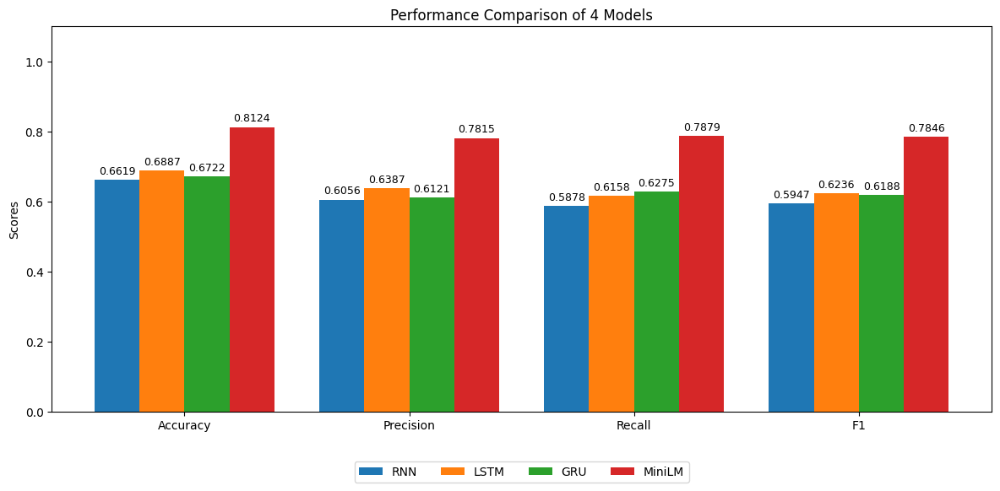

# Financial News Sentiment Inference Project

[]([https://colab.research.google.com/drive/1bBiHOxc63m9JL94JA_SKsgysBBowQP5N?usp=sharing](https://colab.research.google.com/drive/1b_hZuHaE35ZQ3zpJ5BZgFrGjZt2fZ7IB?usp=sharing))


This repository is a production-style refactor of the original Colab notebook above, with GitHub Copilot support for code organization, refactoring, and building inference apps (FastAPI + Streamlit).

You can download the pre-trained model weights from this [Google Drive folder]([https://drive.google.com/drive/folders/1aPVjQnKBoHobLIhyTUywnFQi8qnimWbM?usp=sharing](https://drive.google.com/drive/folders/15vxaTy51I8XPOEpMxkgig1qfp_5wExqV?usp=sharing)) and place them in the `saved_models/` directory.

## 📁 Project Structure

```
.
├── src/                          # Source code
│   ├── api/                      # FastAPI application
│   │   ├── __init__.py
│   │   └── main.py              # API endpoints
│   ├── models/                   # Model loading & inference
│   │   ├── __init__.py
│   │   └── model_loader.py      # Model classes and loader
│   ├── config/                   # Configuration
│   │   ├── __init__.py
│   │   └── config.py            # App settings
│   └── __init__.py
├── ui/                           # Streamlit frontend
│   └── app.py                    # UI application
├── docs/                         # Documentation assets
│   └── images/
│       └── benchmark.png         # Benchmark chart
├── notebooks/                    # Jupyter notebooks
├── saved_models/                 # Pre-trained model weights
│   ├── rnn_model/
│   ├── lstm_model/
│   ├── gru_model/
│   └── minilm_model/
├── requirements.txt              # Python dependencies
├── Makefile                      # Commands for easy execution
└── README.md                     # This file
```

## 📊 Benchmark Performance

Accuracy values collected from notebook workflow and saved artifacts.




## ⚙️ Installation

### 1. Install Dependencies

```bash
make install
```

Or manually:

```bash
pip install -r requirements.txt
```

### 2. Verify Model Files

Ensure all model weights exist in `saved_models/`:

```bash
ls -la saved_models/
```

## 🏃 Running the Application

### Option 1: Run Both Servers (Recommended)

```bash
make run
```

This starts:
- **API Server**: http://127.0.0.1:8000
- **Streamlit UI**: http://localhost:8501

### Option 2: Run Separately

```bash
# Terminal 1: Start FastAPI
make run-api

# Terminal 2: Start Streamlit
make run-ui
```

### Option 3: Manual Run

```bash
# API Server
python -m uvicorn src.api.main:app --host 127.0.0.1 --port 8000 --reload

# Streamlit UI
streamlit run ui/app.py --server.port=8501 --server.address=localhost
```

## 📊 Sentiment Labels

- **Neutral** (0): Neutral financial sentiment  
- **Negative** (1): Negative financial sentiment
- **Positive** (2): Positive financial sentiment


## 📝 Model Specifications

### Custom Models (RNN, LSTM, GRU)

- Embedding Dimension: 128
- Hidden Size: 256
- Layers: 2
- Dropout: 0.3
- FC Dimension: 128
- Max Sequence Length: 128
- Vocab Size: 15,000

### MiniLM

- Max Sequence Length: 512
- Pre-trained: sentence-transformers/all-MiniLM-L12-v2
- Training Epochs: 10


